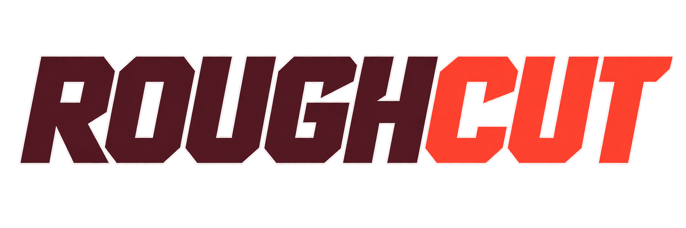

# RoughCut

<p align="center">
  
  <br />
  
</p>

AI-assisted video editing from a local video or URL and a natural-language prompt. Produce an editable JSON cut, with Windows/Linux desktop interfaces and complete headless MCP workflows; a Docker-hosted web edition follows later.

Requirements added on **2026-09-19**: distinguish speakers and allow voice replacement using Qwen TTS. Provider-neutral diarization import with stable correctable speaker IDs, reversible previews, local Sherpa execution, loopback synthesis, bounded duration fitting and sample-validated replacement export now work through CLI/MCP. The first [desktop review](docs/desktop.md) slice adds exact-frame evidence navigation and revisioned speaker-label undo/redo. See the [speaker/voice guide](docs/speaker-and-voice.md) and RC-09 in the work queue.

Also required: retrieve video frames at requested timestamps as agent-readable images through MCP, and accept images through MCP for agent-generated content. The stdio host returns actual PNG content blocks, imports validated PNG assets with provenance, inserts timed stills, previews an exact project revision and exports the result through an explicit lossless-encoding policy. See [image exchange](docs/product-and-architecture.md#mcp-frame-retrieval-and-image-inputs) and RC-10.

Status on **2026-09-21**: the .NET 10 CLI and [stdio MCP host](docs/mcp.md) support JSON projects, transactional edits, staged URL acquisition, captions, local Whisper transcription, source/timeline images, [evidence-backed analysis proposals](docs/analysis.md), cancellable local sherpa-onnx diarization with stable corrections, and loopback Qwen synthesis with fitted voice rendering through the [bounded validated export workflow](docs/export.md). A CupriFace desktop host opens on a project launcher that fetches a URL, creates or opens projects with recent-project history, a native file picker, file drop and a typed path, then renders revision-aware frames, transcript/speaker/evidence rows, persisted speaker-label, crop and clip trim/split/reorder undo/redo, a directly draggable source-frame crop overlay, and seekable VP9/Opus playback of a validated timeline proxy. Frame selection and proxy preparation run in the background; stale selections are canceled and revision writes remain serialized. Windows verification passes 63 checks; the CLI NativeAOT path last passed 56 and cannot currently be rebuilt on the verification machine. A published Windows desktop probe decoded synchronized video/audio with bounded drift, a Windows x64 Sherpa CLI separated the official two-speaker fixture, and a live WSL/CUDA preview was rendered into an exact-duration output. The [MVP](docs/mvp.md) remains incomplete; a physical-device window run and representative diarization quality are next. The public repository is [Wixely/RoughCut](https://github.com/Wixely/RoughCut), licensed under [MIT](LICENSE). Third-party dependencies retain their own licenses.

## Start here

1. Read [AGENTS.md](AGENTS.md).
2. Read the [next-agent handoff](docs/handoff.md).
3. Read the [product and architecture brief](docs/product-and-architecture.md), including confirmed requirements, assumptions and open decisions.
4. Read the [MVP scope](docs/mvp.md) and execute the [work queue](docs/work-queue.md), continuing with a physical-device desktop run and representative speaker measurement.
5. Record evidence using the [validation plan](docs/validation.md) and preserve [decision history](docs/decisions/README.md).

The completed export feasibility slice proves supported copy-only edits, explicit crop/image/voice encoding and unsupported-cut rejection on synthetic video/audio. Read its format limits before using it with other media. Shared operations, local STT and Sherpa diarization, speaker/voice previews, loopback Qwen synthesis and durable export jobs are exposed through stdio MCP. Background-aware replacement, broader desktop editing and broader UI choices still require evaluation.

```powershell
dotnet build RoughCut.slnx
dotnet run --project src/RoughCut.Cli -- help
.\scripts\verify.ps1 -PublishAot
```

See [development commands and limits](docs/development.md), repository-local VS Code debug configurations, and [execution evidence](docs/evidence/2026-09-19-foundation.md). FFmpeg/FFprobe must be available separately. Linux and full editing workflows are not yet verified.

This repository owns implementation context from this point forward. [PLAN discovery history](../PLAN/inbox/roughcut.md), [shared preferences](../PLAN/preferences/README.md), and the [dated feasibility research](../PLAN/knowledge/media/video-editing-feasibility-2026-09-18.md) remain in the sibling PLAN repository. These relative links assume both checkouts share a parent directory.

Recommended next action — Owner: Implementation agent: run the review window on a physical device, covering live pointer trim/split/reorder, audio-device playback and Linux execution, while extending speaker/overlap measurement when representative fixtures are available. Owner: Wixely: restore the MSVC platform linker and the `PATH` FFmpeg build on the verification machine, and provide representative multi-speaker and replacement examples when convenient. Interactive hardware-audio, image-client and broader platform validation remain.
