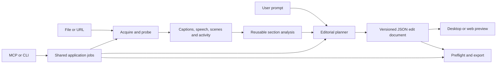

# RoughCut implementation brief

Adapted from the PLAN discovery note on 2026-09-18. This is the canonical implementation brief; preserve the distinction between confirmed requirements and proposals. See [handoff](handoff.md) for current state and [work queue](work-queue.md) for execution order.

- Status: Core/media/CLI, bounded edit/export, live local STT and provider-neutral analysis slices verified on Windows; full MVP incomplete
- Name: RoughCut (confirmed by the user on 2026-09-18)
- Captured: 2026-09-18
- Last reviewed: 2026-09-19
- Next review: Before MCP dependency selection or export-matrix expansion
- Source: User requests on 2026-09-18 and 2026-09-19
- Owner: Wixely (product decisions); Agent (design and implementation)
- Repository hosting, visibility, and license: Undecided

## Intended product

The [working MVP and milestones](mvp.md) now define implementation sequencing. See [development](development.md) for implemented commands and limits; the broader requirements below remain the product brief.

A simple AI-assisted video editor that takes a local video or URL and a natural-language prompt, analyses the content, and produces an editable cut. Prime examples: **"Remove the bad/boring parts"** and **"Remove advertisements"** from a YouTube video. Windows and Linux desktop editions come first; the same engine must later support a Docker-hosted web edition. Every workflow must also be usable entirely headlessly through MCP.

### Confirmed requirements

- Focus editing on trimming, spatial cropping, splitting into slices, removing slices, and reordering them.
- Show the edits in a basic UI. The simplest entry point is a URL and prompt.
- Persist the work in JSON so proposed or completed edits can be reopened and changed.
- Identify sections of a video and qualify them for the user's request. Keep content analysis, transcription, and editing components separate for later reuse.
- Use local speech recognition; Whisper is an acceptable candidate. Import yt-dlp subtitles and assess whether they are better than local transcription before transcribing unnecessarily.
- Distinguish different speakers in source audio and allow voice replacement using Qwen TTS (confirmed 2026-09-19). The concrete diarization backend, Qwen model and runtime remain to be evaluated.
- Retrieve an image at any valid video timestamp through MCP so an AI agent can inspect it. Accept images through MCP so agents can bring generated visual content into the project (confirmed 2026-09-19).
- Support yt-dlp downloads and FFmpeg processing, with configurable executable paths and related settings.
- Prefer muxing/stream copy. Offer a "perfect mux" option that cuts only at safe frame boundaries. Warn that processing will take longer when edits need re-encoding.
- Keep the application mostly managed C#. FFmpeg and yt-dlp external dependencies are explicitly acceptable.
- Reuse suitable Wixely GitHub libraries; the user permits implementing suitable integrations. Do not treat this as a requirement to use every candidate.

## Proposed first user flow

1. Paste a URL or choose a local file, enter a prompt, and select the output location.
2. Import media, available captions and metadata; probe the streams; choose a transcript source; analyse sections. Show progress and allow cancellation.
3. Show a preview, a simple slice timeline, and a list of proposed removals with reasons and uncertainty. Clicking a reason seeks to its source evidence. Allow keep/remove, boundary adjustment, crop, and drag-to-reorder; include undo/redo.
4. Show requested versus achievable boundaries and whether each stream will be copied or encoded. Explain the processing-time and quality implications before export.
5. Save the JSON project and export. Reopening the project restores the timeline without repeating valid analysis.

Proposal: default to reviewing uncertain editorial choices, while allowing an explicit automatic/headless policy. MCP callers can supply that policy in the request; no GUI dialog may be required to finish a headless job. "Boring" is subjective: retain uncertain sections by default and explain the judgement rather than silently equating silence or low motion with unwanted content. Define advertisements in the first acceptance case as segments present in the acquired media, including embedded sponsorships.

## Reusable component boundaries

Use C#/.NET 10 with app-neutral contracts. These are proposed package boundaries, not committed package names.

| Component | Owns | Must remain independent of |
| --- | --- | --- |
| Media acquisition | Local-file import, yt-dlp adapter, caption/metadata discovery, source provenance | UI, edit policy, inference |
| Media inspection | FFprobe adapter, streams, time bases, packet/frame index, decode-boundary assessment | Prompts and editor state |
| Image exchange | Timestamp-based frame decoding, image validation/import, portable asset references and provenance | Image-generation provider and UI |
| Speech and subtitles | Caption parsing/normalisation, timed speech results, alignment, quality assessment, local STT adapter | Timeline and ad-removal rules |
| Speaker analysis | Speaker diarization, stable speaker IDs, timed assignments, overlap/unknown annotations and manual corrections | TTS provider and UI |
| Speech synthesis | Qwen TTS adapter, voice selection, synthesis jobs and generated-audio provenance | Speaker detection and export policy |
| Content analysis | Scene/shot and speech/topic boundaries, silence/activity signals, section labels and evidence | Export execution |
| Editorial planning | Prompt interpretation, proposed keep/remove/crop/order decisions, rationale and uncertainty | Shell commands and codecs |
| Edit document | Versioned JSON, validation, revisions, source-to-output mapping, undoable edits | UI and model provider |
| Export engine | Capability preflight, safe-copy planning, FFmpeg execution, subtitle retiming, output validation | AI judgements |
| Application jobs | Cancellation, progress, durable checkpoints, bounded concurrency, artifact access | Desktop-specific APIs |
| Hosts | Desktop UI, CLI, MCP, later HTTP API/web UI and worker | Duplicated media/business logic |



The analyser produces reusable, time-indexed observations even when no edit is requested. The planner consumes those observations and produces proposals. The deterministic export engine validates the document and never executes model-generated command lines.

## Understanding and qualifying video

- Combine timed speech/captions, chapter metadata, scene changes, silence/activity and representative frames. STT provides words; it does not by itself identify visual advertisements, failed takes or interesting action.
- Keep speech segments, visual shots and semantic sections as distinct intervals; they need not share boundaries. Preserve their relationships and original source timestamps.
- Store labels such as sponsorship, introduction, repeated take, dead air or topic change with supporting transcript/frame references, provider/model version and uncertainty. Do not present uncalibrated model scores as measured probabilities.
- Use a replaceable inference interface for semantic and optional visual analysis. The model can be supplied by a configured local endpoint or an MCP caller; which mode the standalone desktop defaults to is open. Local STT does not imply that all AI inference is local.
- The bounded implementation accepts provider-neutral evidence and observations through CLI/MCP, records qualitative certainty and applies revision-bound conservative policies. MCP-supplied observations are the first accepted provider mode; a standalone semantic model remains optional and undecided.
- For long videos, use bounded chunks with overlap and context summaries, reconcile duplicate observations, and map all timestamps back to the original media. Cache observations by source fingerprint and analysis configuration. Do not load the complete decoded video or audio into RAM.
- Preserve sentence endings and context when proposing cuts. Show tradeoffs if a safe-copy boundary would retain an ad fragment or remove useful speech.

## Choosing subtitles or local transcription

1. Enumerate embedded, sidecar, creator-supplied and automatically generated captions, including language and translation status. Retain provenance and originals.
2. Normalise cues, remove rolling-caption duplicates, and check coverage of speech, language match, timing drift, gaps, overlaps, implausible text and readability.
3. Treat human/creator captions as a useful prior, not proof of accuracy. A polished translation may be less useful for timing than original-language auto captions.
4. When uncertain, compare representative audio samples with local STT and timing evidence. Agreement is a heuristic, not ground truth; avoid comparing raw confidence numbers from unrelated engines.
5. Select the best candidate or transcribe only deficient regions; offer an explicit track override. Record why a candidate was selected. Word alignment can be needed even when subtitle text is retained.
6. Re-time, split and reorder retained captions using the final export mapping. Omit removed content; do not burn captions into the picture by default.

## MCP frame retrieval and image inputs

Both directions of image exchange are confirmed requirements. A bounded source-frame API/CLI and stdio MCP host are implemented; the official MCP client receives PNG content blocks, imports validated PNG assets, inserts timed images, previews an exact revision and completes encoded export. Interactive AI-agent visual interpretation remains an acceptance check for RC-10.

- `get_frame`: accept a source ID, video stream and rational timestamp, with optional bounded image size/format settings. Retrieve the displayed frame at any valid timestamp in supported decodable media, including between keyframes: seek to a suitable decode point and decode forward. Return requested time, actual frame presentation time and duration/time base, source fingerprint, dimensions, format and image content that the calling agent can inspect, not just a server-local filename.
- Define timestamp origin and selection precisely. Proposed default: source-relative presentation time, selecting the frame whose half-open display interval contains the requested time. Handle variable frame rate and nonzero stream start times; reject negative/out-of-range requests and report gaps or undecodable media explicitly instead of substituting an unexplained nearby thumbnail. Apply orientation and pixel-aspect handling and report any resizing or colour conversion.
- Distinguish source inspection from edited-timeline preview. A timeline request must identify the project revision and resolve cuts, reordering, crop and inserted images through the same mapping as export; report both output time and contributing source/asset references. Use bounded jobs for expensive rendering, with cancellation and limits on batches, dimensions, memory and response bytes.
- `import_image`: accept bounded encoded image data with a declared media type through MCP, validate by decoding and return a stable project asset ID, dimensions, verified format and content hash. An optional resource/upload-reference path must be explicitly supported by the chosen transport; do not assume access to arbitrary resources on another MCP server. Validate size, pixel count and allowed formats before expensive processing; treat embedded metadata and visible text as untrusted content.
- Allow an agent to inspect a frame, use its chosen external image-generation tool, then send the resulting image back through MCP. RoughCut owns import, provenance and editing; this requirement does not select or install an image generator. Record source-frame links and generator details when supplied without treating them as verified facts.
- Implemented minimum content workflow: insert an imported image as a timed still-image clip, with explicit duration, `contain`/`cover` fit, optional crop and silence policy, preview it, reorder/remove it and export it through explicit lossless encoding. Broader overlays/compositing remain an open scope choice. Import alone does not mutate the timeline; timeline changes use explicit revision-checked edit operations and support revert through saved revisions.
- Store image assets using portable project-relative references and fingerprints, with atomic writes and relinking rules. Keep binary payloads out of edit JSON and ordinary tool logs; imported/generated assets remain ignored local media. Returning frames to a calling agent is an explicit media-read operation subject to configured project access; background analysis must not silently send images to other providers.
- Verify image-bearing responses with the selected MCP SDK and an actual image-capable client. Provide bounded previews and retrievable full-size assets when needed; callers must be able to read the image without a GUI, shared filesystem or undocumented URL access.

## Speaker distinction and Qwen TTS voice replacement

The capability is confirmed; the following workflow and contract details are proposals for RC-01 and RC-09. Speaker distinction means assigning speech to consistent speaker labels within a source, not inferring a person's real-world identity.

- Analyse speaker turns independently of transcript selection. Imported captions may supply usable words without usable speaker labels. Preserve source-time intervals, uncertain/unknown assignments and overlapping speakers; reconcile IDs across processing chunks.
- Allow users to preview, rename, merge, split and correct speaker assignments. Map a selected speaker to a Qwen TTS voice, with optional interval overrides; leave unselected speech unchanged. Preserve original text/audio and make replacement reversible.
- Synthesize from reviewed transcript text. Record voice configuration, model/runtime version, text revision, generated asset hashes and requested versus actual durations. Do not assume TTS automatically provides speaker diarization, source separation or exact-duration output.
- Propose preserving the edit timeline by default. Preflight duration mismatches and use an explicit fit policy with bounded adjustments or return an unresolved result; never silently truncate words or shift later dialogue. Map generated audio and captions through cuts and reordering, invalidating cached synthesis when its inputs change.
- Evaluate isolated dialogue tracks and mixed speech/music separately. Replacing speech in a mixed track requires a validated separation/mixing strategy to preserve background sound and other speakers. Report unsupported overlap or separation cases rather than silently deleting the whole audio interval or leaving the original voice underneath.
- Expose speaker inspection/correction, voice mapping, synthesis preview, apply/revert and cancellation through shared jobs and MCP as well as the UI. Persist decisions in versioned JSON with portable asset references; generated audio and voice reference samples remain private, ignored artifacts.
- Evaluate local execution first as a proposed default. The exact Qwen TTS model/version, supported voice modes, languages, license, CPU/GPU requirements, runtime and Windows/Linux/AOT compatibility require evidence before adoption. Voice cloning and translation are not implied requirements. Cloud execution requires an explicit disclosure choice; naming Qwen TTS does not authorize new runtimes or integrations.

## Export modes and safe cuts

The [implemented feasibility slice](export.md) now supports a narrow Windows-validated Matroska matrix and returns explicit unsupported results outside it. It rejects unaligned boundaries instead of implementing the broader proposed snapping behavior below. [Execution evidence](evidence/2026-09-19-export.md) records the copy/encode, decoded-content and audio checks.

"Perfect mux" means **a validated copy-only edit at supported, independently decodable boundaries**, not arbitrary frame accuracy. The relevant failure is retaining dependent pictures after removing pictures they reference; an I-frame flag alone is not a universal proof of a safe boundary. The [feasibility record](../../PLAN/knowledge/media/video-editing-feasibility-2026-09-18.md) contains the FFmpeg evidence and limitations.

| Proposed mode | Behaviour |
| --- | --- |
| Prefer stream copy | Preflight each stream, use copy where safe, and report any required encoding plus slower processing before export. Retain requested edit intent. |
| Perfect mux / copy only | Resolve both ends of each slice to validated safe boundaries within a configured tolerance. Show every adjustment. If safety or stream compatibility cannot be established, return an unsupported-cut result with alternatives; do not silently encode. |
| Exact edit | Honour selected display-frame boundaries and spatial crop through encoding where necessary. Warn about longer processing and possible quality change; copy unaffected streams where valid. |

Implementation gates:

- Check codec-specific random-access and reference dependencies at both ends, including open GOPs, reordered B-frames, and codec configuration. Treat unknown codec cases as unsupported in strict mode until tested.
- Validate audio packet boundaries, encoder delay, timestamps, stream compatibility and A/V synchronisation across each join. Copy-only cannot promise arbitrary sample-accurate audio cuts.
- Preserve presentation/decode timestamps and rational time bases; support variable frame rate without deriving all timing from a nominal FPS. Reordering slices also reorders captions and chapters.
- Spatial pixel cropping normally needs video encoding. Container/display-crop metadata is not a general equivalent, and must not be used silently to claim the pixels were removed.
- Voice replacement creates new audio and requires rendering/mixing and an explicit audio encoding plan. Strict perfect-mux rejects active replacements; an encoding-permitted mode may still copy unaffected video when safe. Show per-stream decisions and verify speech timing, background preservation and A/V sync.
- Still-image clips or image composites require rendered video and an explicit encoding plan; strict perfect-mux rejects such timeline edits. Extracting a frame or importing an unused image does not itself change export eligibility.
- Keep requested boundaries and resolved export boundaries separately. A user-set snapping tolerance is a limit, not permission to conceal a semantic change.
- Validate the finished file and decode around joins; FFmpeg exit code zero alone does not demonstrate valid cuts. Leave the source untouched and write the output atomically.
- Defer smart rendering (encode only edge GOPs) until codec/container and audio continuity are proven. It is an optimisation candidate, not a promised first-release feature.

## JSON project proposal

Use a versioned, human-editable JSON project as the source of truth. Keep machine-specific executable paths and credentials in separate application configuration. Resolve relative media paths from the project directory and allow explicit relinking on another host. Fingerprint assets so cached evidence cannot silently apply to a changed file.

The following is the historical discovery example, not the implemented development schema or a claim that these boundaries are copy-safe. The current baseline is defined in `src/RoughCut.Core/Contracts.cs` and emitted by `create`; it uses `assets` and per-clip asset references. Intervals are half-open; tick values use the declared project time base. Preserve the original per-stream time bases in probe data.

```json
{
  "schemaVersion": 1,
  "projectId": "example-edit",
  "revision": 1,
  "prompt": "Remove advertisements",
  "timeBase": { "numerator": 1, "denominator": 1000000 },
  "sources": [{ "id": "source-1", "path": "media/source.mp4" }],
  "analysisPath": "analysis/source-1.json",
  "transcript": { "source": "downloaded-subtitles", "path": "captions/source.en.vtt" },
  "decisions": [
    { "id": "decision-1", "sourceId": "source-1", "start": 12000000, "end": 20000000,
      "action": "remove", "label": "sponsorship", "evidenceIds": ["section-2"], "status": "proposed" }
  ],
  "timeline": [
    { "id": "slice-1", "sourceId": "source-1", "in": 0, "out": 12000000, "crop": null },
    { "id": "slice-2", "sourceId": "source-1", "in": 20000000, "out": 60000000, "crop": null }
  ],
  "export": { "mode": "prefer-stream-copy", "path": "output/edited.mp4" }
}
```

Array order defines playback order. A crop is a rectangle in documented source display coordinates after orientation handling. The eventual schema must also define source hashes, stream selection, transcript-selection evidence, export policy, revisions and migrations. Save export resolution separately with the project revision/hash, tool versions, actual slice boundaries, copy/encode decisions and output validation results. Reject invalid references, out-of-range times and unsupported schema versions; save atomically and detect concurrent UI/MCP revision conflicts.

RC-01 must also define speaker records, timed speaker assignments (including overlap/unknown), corrections, speaker-to-voice mappings, replacement intervals, synthesis provenance and generated-audio source-to-output mappings. The minimal example above omits these optional features; older projects without voice replacement must retain their meaning on migration.

Image contracts must define asset IDs, portable paths, hashes, dimensions, media types and provenance, frame requests/results with explicit time coordinates, and timed image clips with duration/fit/audio policy. Preserve image assets and their edit references on save/reopen; reject missing or changed assets during preflight. The minimal JSON example also omits these optional fields.

## Existing Wixely components to evaluate first

See [dated source verification](../../PLAN/knowledge/media/video-editing-feasibility-2026-09-18.md#wixely-reuse-candidates) for current evidence; these are proposed selections, not installed dependencies.

| Candidate | Proposed use and work required |
| --- | --- |
| [Bantz speech packages](../../PLAN/projects/github/bantz/current-work.md) | First choice for local Whisper and model/runtime management. Add an app-neutral timed-segment capability and bounded long-file processing while preserving existing dictation consumers. Avoid taking microphone capture and global input packages for file transcription. |
| [CupriFace](../../PLAN/projects/github/cupri/README.md#cupriface-relationship) | First desktop UI candidate. Prove seekable preview, synchronised audio, timeline interaction and crop overlays on Windows and Linux before choosing it. Keep playback behind an adapter; do not assume an HTML-like video element supplies media playback. |
| [DnaX](../../PLAN/projects/github/dnax/README.md) | Evaluate host paths, cache/diagnostics and remote API/MCP hosting. Consider experimental uploads for the later web edition only after large-video validation. A database is unnecessary for the initial portable JSON project. |
| [MCPSharp ecosystem](../../PLAN/projects/github/mcpsharp/README.md) | Reuse service/CLI/stdio/HTTP conventions; choose a concrete host implementation rather than assuming MCPSharp is one shared library. Evaluate DnaX.RemoteAccess.Mcp for HTTP. |
| [H264Sharp](../../PLAN/projects/github/h264sharp/README.md) | Optional managed H.264 inspection/thumbnail/reference-analysis aid. Verify supported profiles and performance first; retain FFmpeg for broad codec processing. Do not build the entire editor around an H.264-only capability. |

## Hosting, configuration and dependencies

- Apply [development preferences](../../PLAN/preferences/development.md): .NET 10, top-level entry points, AOT where feasible and tested. Present minor sacrifices that enable AOT to the user. Native tools, inference models and native libraries remain explicit external assets; a single managed executable does not eliminate them.
- Propose desktop plus CLI and stdio MCP initially. Keep a versioned application API for the later web host and Streamable HTTP MCP; use the same project validation and job commands throughout. Typical operations: import, inspect, analyse, propose edits, read/update project, preflight export, start export, job status and cancel. Return job IDs rather than holding tool calls open for an entire video.
- The future server should run interactively, as a Windows Service, under systemd, and in Docker. Mount project/media/model/cache directories explicitly. Headless startup must not load a desktop toolkit or require a display/audio device. Browser playback may require a proxy format even when the final export remains copy-only; keep those separate.
- Default the future browser UI to Blazor under existing preferences; it shares contracts and engine behaviour, not necessarily desktop rendering code. Server-side Blazor retains its normal-runtime exception.
- Configure FFmpeg, FFprobe, yt-dlp, model/runtime paths, workspace/cache/temp/output roots, inference endpoint/model, caption languages, CPU/GPU choice, concurrency and export policies. Validate paths, executable versions and available codecs/backends and show actionable diagnostics.
- The bounded standalone yt-dlp C# process adapter is implemented with fixed staging paths, portable manifests, explicit limits, ignored user configuration, cancellation and argument arrays. Its explicit dependency allowance does not authorise Python/Node.js development tooling. Live YouTube acquisition through standalone yt-dlp and Deno is verified on Windows for the RC-03 fixture.
- **Accepted Windows RC-03 dependencies:** current YouTube extraction uses an explicit standalone Deno executable with remote yt-dlp components disabled. Local timed STT uses Whisper.net/runtime 1.9.1 and the pinned base.en model behind the provider-neutral chunk boundary. The main CLI remains separate from native Whisper and retains its NativeAOT path.
- For the later network host, constrain media/output access to configured roots, authenticate HTTP/MCP access, bound jobs, and validate URL redirects/download destinations. Transcripts, captions and video text are untrusted evidence, never tool instructions. Cloud inference, if offered, must be an explicit user-selected disclosure mode.

## Assumptions and open decisions

- Proposed MVP scope: one source video, one output timeline, hard cuts and a fixed crop per slice; no transitions, compositing or multitrack editor. Reordering slices is included.
- The 2026-09-19 image requirement extends that proposal with MCP frame retrieval and incoming image assets. RC-10 implements timed still-image insertion as the minimum generated-content workflow with bounded PNG transport; broader overlays/compositing and interactive agent-client acceptance remain to validate.
- Speaker distinction and Qwen TTS replacement are required product capabilities, planned in RC-09 after the deterministic export slice. Audio mixing needed for replacement does not by itself commit to a general multitrack editing UI. Agent evaluates the backend and fit/separation policies; Wixely resolves material quality, dependency and deployment tradeoffs.
- Product name: RoughCut, confirmed by Wixely on 2026-09-18. This replaces the initial descriptive working title, "AI-assisted video editor".
- Local repository creation was authorized on 2026-09-18. Wixely: choose hosting/visibility before remote creation; local work can proceed.
- Wixely: choose semantic/visual inference expectations: an existing local endpoint, another local model backend, or an explicitly enabled remote provider. STT remains local.
- Agent with Wixely: choose initial input/output codec coverage, performance targets, languages and the acceptable safe-cut adjustment policy from representative videos.
- Desktop toolkit, playback backend, exact JSON schema and any reusable-library changes remain proposals until the feasibility slice validates them.

## Risks and acceptance gates

| Risk | Required check | Owner |
| --- | --- | --- |
| Stream-copy joins lose reference pictures or drift | Fixtures with open/closed GOPs, B-frames, VFR, nonzero start times and audio priming; decode joins, check timestamps and compare retained content. Unsupported strict-copy cases must fail honestly. | Agent |
| AI removes useful material or leaves an ad fragment | Labelled ad/no-ad and subjective-edit examples, boundary review and reversal; report false removals separately from missed removals. | Agent / Wixely |
| Caption selection picks polished but mistimed text | Human, auto, translated, drifting, partial and absent-caption fixtures; show selection evidence and test manual override. | Agent |
| Long media exhausts memory or cancellation corrupts state | Long-file, chunk overlap, cancellation/resume, disk-full and failed-tool tests; bound RAM and preserve source/project. | Agent |
| Desktop and headless implementations diverge | The same JSON revision produces the same resolved edit mapping via desktop, CLI and MCP. Reopen/manual-edit round trips preserve meaning. | Agent |
| AOT/native packaging or preview differs by OS | Publish and execute the selected dependency stack on Windows and Linux, including sound, seeking, model loading and external-tool paths. | Agent |

## Next actions

1. **Agent:** Specify the timed speech and edit-document contracts, including source-time mapping, without introducing UI dependencies. Extend Bantz compatibly only after reading its current instructions/source and testing existing consumers.
2. **Agent:** Build the first vertical feasibility slice when implementation begins: local clip plus supplied captions, explicit cut list saved to JSON, strict-copy preflight/export and decoded-join verification. Include one crop that correctly selects encoding and one unsupported copy-only cut.
3. **Agent:** Add URL/subtitle acquisition and local STT fallback, then semantic ad-removal proposals with evidence; validate on a labelled example chosen by Wixely.
4. **Agent:** Add MCP job operations and the desktop preview; prove Windows/Linux and headless parity before promoting to an application release.
5. **Wixely / Agent:** Resolve open product/dependency choices and remote hosting when needed. The local repository exists; promote the PLAN pointer under its chosen host only after that host is selected. Plan web/Docker against the same contracts.

The initial contract/frame, bounded image-aware export, stdio MCP/job, live RC-03 acquisition/local-STT, provider-neutral RC-04 analysis and reversible speaker/voice preview slices are implemented; the preceding discovery sequence remains context for the broader product. Recommended next action: **Agent** should add a cancellable local Qwen provider after runtime approval and evaluate diarization, with **Wixely** providing representative multi-speaker and replacement examples. UI, live model integrations, replacement rendering and broader media/platform acceptance remain.
